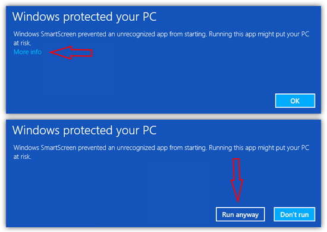
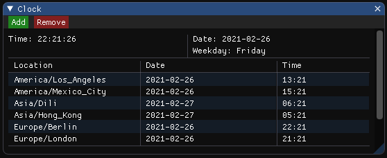
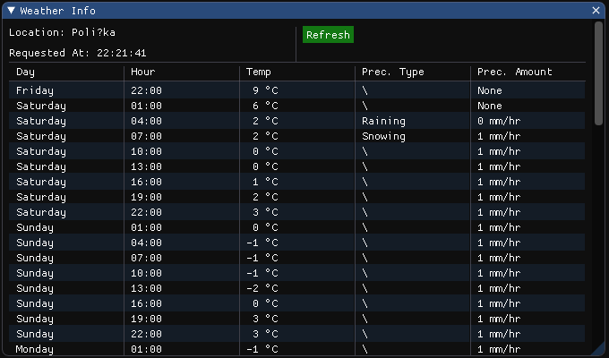
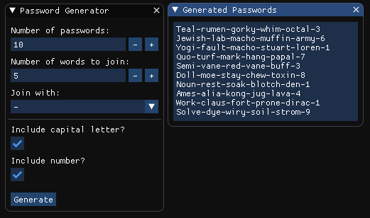

### Introduction

---

A minimalistic Windows app framework powered by [DearPyGUI](https://github.com/hoffstadt/DearPyGui).

PyPanel offers a wide variety of discrete tools, such as:
* Monitoring sub-apps (i.e. Weather, HW Info, Game Server Info)
* Financial sub-apps (i.e. Stocks, Exchange rates)
* Notification sub-apps (i.e. Twitch, Youtube, Downdetector)

Sub-apps are continually added, as are performance and design features.

For upcoming sub-apps and features see [Feature Tracker](https://github.com/Finoozer/PyPanel/projects/2)

### Disclaimer

---

:heavy_exclamation_mark: PyPanel is developed as an open-source software, with no intention to go commercial. 
For this reason, it is not viable for us to get a costly signature certification.

**What does this mean?**

When you install or update PyPanel, Windows will warn you that this software is from an unknown publisher.
You can skip this warning by clicking on "**More Info**" and "**Run anyway**"



**Can I trust PyPanel?**

We have employed 4096 bit GPG signing for every commit, so that users can be sure of PyPanel's integrity. In the 
future, we want to encrypt most, if not all, of the files stored on your PC. However, this does not imply PyPanel is 
guaranteed to be secure.

You can also build PyPanel yourself; just head to the [Build](#build) section.

For more info read [License](LICENSE.txt).


### Getting started

---

#### Installation :arrow_down:
Installing PyPanel couldn't be easier:
1. Head over to [Releases Page](https://github.com/Finoozer/PyPanel/releases)
2. Under Assets, you will find `PyPanel-vX.X.X.exe`, download it
3. Go through the setup wizard
4. Done!

#### How to use profiles?


_Profiles are used to save your apps, settings and data._


1. Once you open PyPanel, the first thing you want to do is create your own profile. You can do so, by either clicking 
on `Save Profile` or `Profiles -> Add`

2. You will be prompted to choose a name for your profile. After clicking on `Add` your profile is loaded as a blank 
template. Now click on the menubar item `Apps`. Here, you'll find all the apps currently implemented in PyPanel.

_PyPanel stores not only data you put in, but also the sub-app window positions and sizes._

3. After you are done setting up your PyPanel workspace, hit `Save Profile`.

---

:warning: ***Upon creation of a new profile, you start with a blank template. Open windows from
previously loaded profile are NOT transferred.***

:warning: ***Profiles do NOT auto-save. You have to click on `Save Profile`***

Warnings above will be fixed in upcoming versions of PyPanel.

### Sub-apps

---

#### RustApp
Monitor number of joined, queued and max players on a Rust server using Battlemetrics' URL.

#### ClockApp
A simple app to display local or remote time.

#### WeatherApp
Local weather forecast. Displays temperature, precipitation type (i.e. raining, snowing) and amount (in mm/hr) for the 
next 8 days.

#### PassGenApp
Generate stronger and easier to remember passwords. Based on [xkcd #936](https://xkcd.com/936/).

### Build

---

Building PyPanel from source code is a straightforward process.
0. Install Python >= 3.9.0
1. Install [PyInstaller](https://www.pyinstaller.org/)
2. (Recommended: Install [pyinstaller-versionfile](https://pypi.org/project/pyinstaller-versionfile/))
3. Create a .yml file called metadata
    ```yaml
    Version: x.x.x
    FileDescription: PyPanel
    InternalName: PyPanel
    LegalCopyright: MIT
    OriginalFilename: PyPanel.exe
    ProductName: PyPanel
    ```

4. Create a powershell script in the project root folder

    ```powershell
    # locate your venv
    .\venv\Scripts\activate
    # create VERSION file from metadata
    create-version-file metadata.yml --outfile VERSION --version x.x.x
    # build
    pyinstaller script.py -F `
    --name "PyPanel" `
    --windowed `
    --icon "docs\img\ico\icon.ico" `
    --onedir `
    --add-data "data\*;data" `
    --add-data "data\*.txt;data" `
    --add-data "data\*.png;data" `
    --version-file "VERSION" `
    --clean
    ```
5. Run the PS script

### Credits

---

| Dependencies |  |
| --- | --- |
| [DearPyGui](https://github.com/hoffstadt/DearPyGui) | [pytz](https://pypi.org/project/pytz/)
| [geocoder](https://pypi.org/project/geocoder/) | [requests](https://github.com/psf/requests)
| [PyAutoGUI](https://pypi.org/project/PyAutoGUI/) | [PyInstaller](https://www.pyinstaller.org/)
| [Inno Setup](https://jrsoftware.org/isinfo.php)

### License

---

PyPanel is licensed under the [MIT License](https://github.com/Finoozer/PyPanel/blob/master/LICENSE.md).